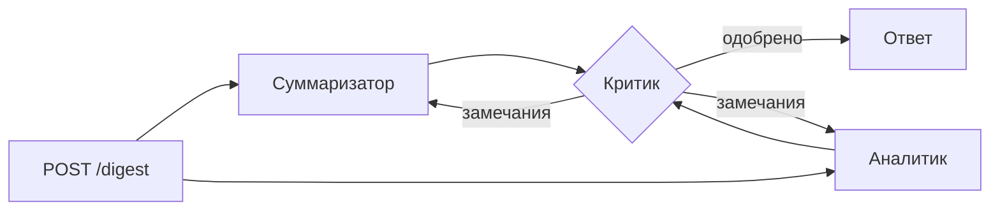

# Chat Digest Agents

REST API на FastAPI, который разбирает переписку группового чата с помощью нескольких LLM-агентов. На выходе получаются краткое содержание, список задач с исполнителями и сроками и принятые решения.

Это первая часть проекта. Вторая — Telegram-бот для групповых чатов, который будет использовать этот API как бэкенд.

## Как это работает

Три агента с разными ролями:

- **Суммаризатор** пишет краткое содержание обсуждения.
- **Аналитик** извлекает задачи (что, кто, до какого срока) и принятые решения в формате JSON.
- **Критик** проверяет результат двух других агентов по исходной переписке: ничего ли не упущено и не выдумано.

Суммаризатор и аналитик работают параллельно. Если критик находит проблемы, оба агента переделывают работу с учётом его замечаний. Число доработок ограничено настройкой `MAX_REVIEW_ROUNDS`.



В ответе есть `trace`: какой агент в каком раунде сколько времени работал.

## Архитектура

```
app/
  main.py       # эндпоинты FastAPI, обработка ошибок
  schemas.py    # Pydantic-схемы запроса и ответа
  pipeline.py   # оркестратор: порядок агентов и цикл доработки
  agents.py     # агенты, их промпты и разбор ответов модели
  llm.py        # клиент для OpenAI-совместимых API
  demo_llm.py   # демо-режим без настоящей модели
  static/       # веб-интерфейс (одна HTML-страница без сборки)
  config.py     # настройки из .env
tests/          # тесты пайплайна и API с заглушкой вместо LLM
examples/       # пример запроса
```

Агенты зависят только от интерфейса `LLMClient` с методом `complete(system, user)`. Поэтому модель меняется одной строкой в `.env`, а в тестах вместо неё подставляется заглушка с заранее заданными ответами.

## Запуск

Требуется Python 3.10+.

```bash
python -m venv .venv
# Windows: .venv\Scripts\activate    Linux/macOS: source .venv/bin/activate
pip install -r requirements.txt
cp .env.example .env               # Windows: copy .env.example .env
uvicorn app.main:app --reload
```

После запуска доступны:

- http://127.0.0.1:8000/ — веб-интерфейс: переписка в виде чата, результат в виде карточек задач и диаграммы работы агентов;
- http://127.0.0.1:8000/docs — интерактивная документация API (Swagger).

По умолчанию включён демо-режим (`LLM_PROVIDER=fake`): сервис работает без модели и ключей, а ответы строятся по простым правилам.

### С настоящей моделью через Ollama

1. Установите [Ollama](https://ollama.com) и скачайте модель: `ollama pull qwen2.5:7b`.
2. В `.env` укажите `LLM_PROVIDER=openai`, остальные значения по умолчанию уже подходят для Ollama.
3. Перезапустите сервис.

Подойдёт и любой другой OpenAI-совместимый API: поменяйте `LLM_BASE_URL`, `LLM_API_KEY` и `LLM_MODEL`.

## Пример

Запрос `POST /digest`:

```json
{
  "messages": [
    {"author": "Боря", "text": "Я возьму бэкенд, доделаю API до среды"},
    {"author": "Вика", "text": "Подготовлю презентацию до пятницы"},
    {"author": "Боря", "text": "Договорились, репетицию делаем в субботу в 12:00"}
  ]
}
```

Ответ (сокращённо):

```json
{
  "summary": "...",
  "tasks": [
    {"text": "Доделать API", "assignee": "Боря", "deadline": "до среды"},
    {"text": "Подготовить презентацию", "assignee": "Вика", "deadline": "до пятницы"}
  ],
  "decisions": ["Репетиция в субботу в 12:00"],
  "review": {"approved": true, "issues": []},
  "rounds": 1,
  "trace": [
    {"agent": "summarizer", "round": 1, "duration_ms": 1840},
    {"agent": "extractor", "round": 1, "duration_ms": 2310},
    {"agent": "critic", "round": 1, "duration_ms": 1520}
  ]
}
```

## Эндпоинты

| Метод | Путь | Описание |
|---|---|---|
| `GET` | `/` | веб-интерфейс |
| `GET` | `/health` | проверка, что сервис жив |
| `POST` | `/digest` | разбор переписки агентами |

Коды ответов: `200` при успехе, `422` при некорректном запросе (например, пустой список сообщений), `502` если модель недоступна или вернула ответ, который не удалось разобрать.

## Тесты

```bash
pytest
```

Тесты не обращаются к настоящей модели: вместо неё используется заглушка. Проверяются цикл доработки по замечаниям критика, лимит раундов, разбор JSON из ответов модели, коды ответов API и отдача веб-страницы.

## Планы

- [ ] Telegram-бот для групповых чатов с командой `/summary`
- [ ] Хранение истории запусков
- [ ] Dockerfile
